#VemSerDBC10
#HTML/CSS
### Neste repositorio estao as atividades e homeworks desenvolvidos no modulo de HTML/CSS.

### Acompanhe minha evolução!!! 😊😊😊

📌 #exercicio1

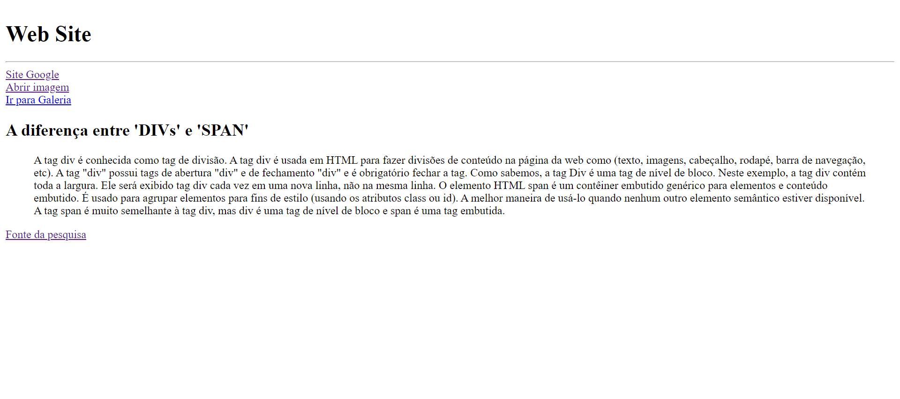

📌 #homework1
- Atividade desenvolvida em HTML

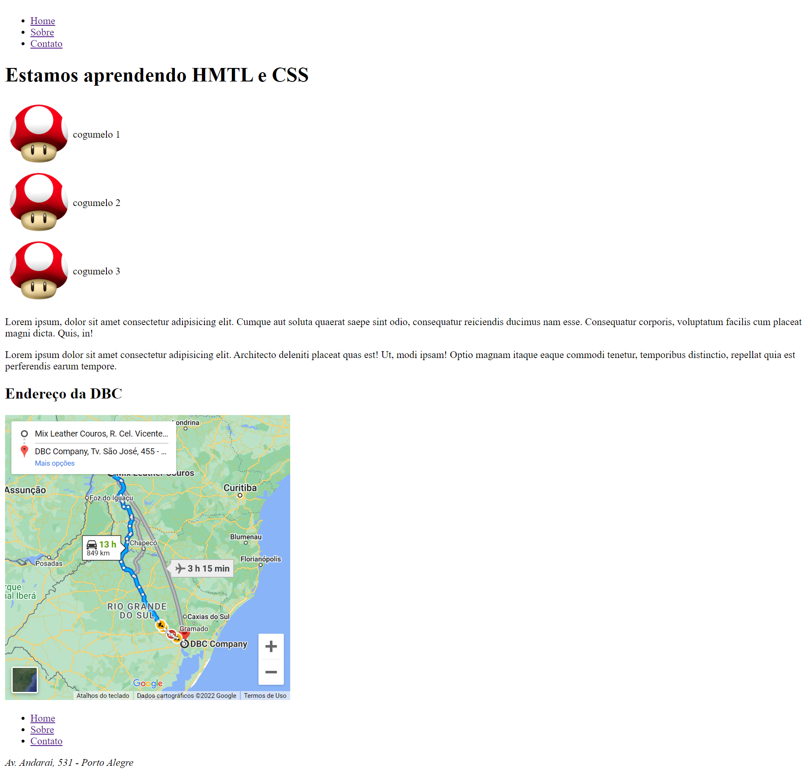

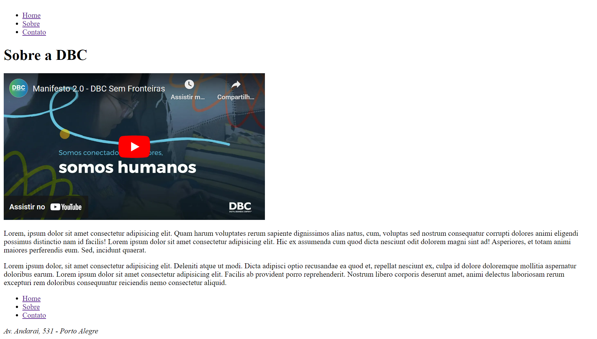

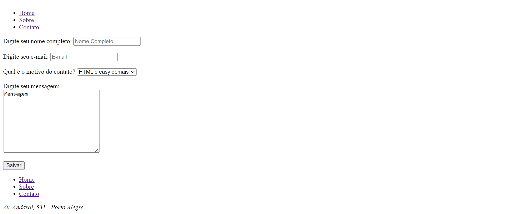

📌 #exercicio2
- Construcao de uma pagina com html e csss usando tags semanticas.

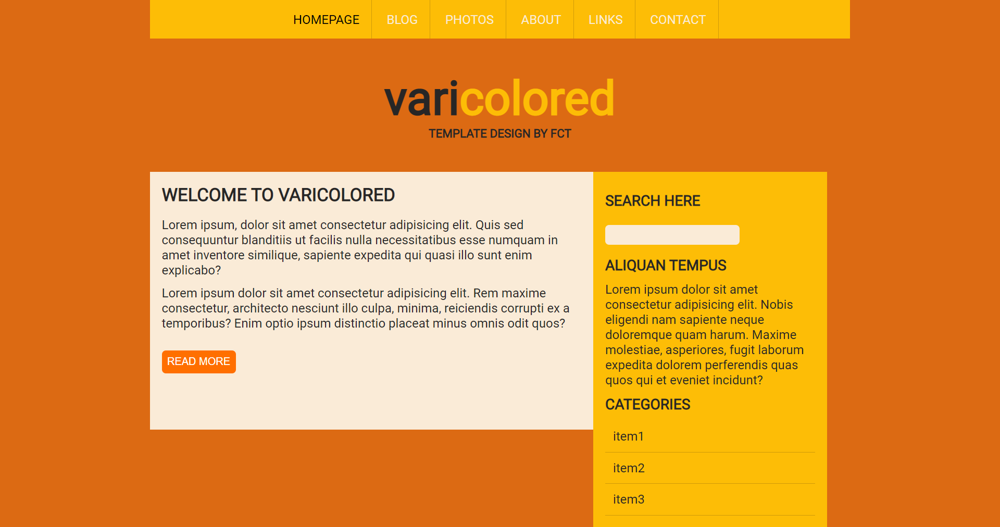

📌 #homework2
- Construcao de um site com HTML utilizando tags semanticas e CSS a partir de um modelo do Figma. 

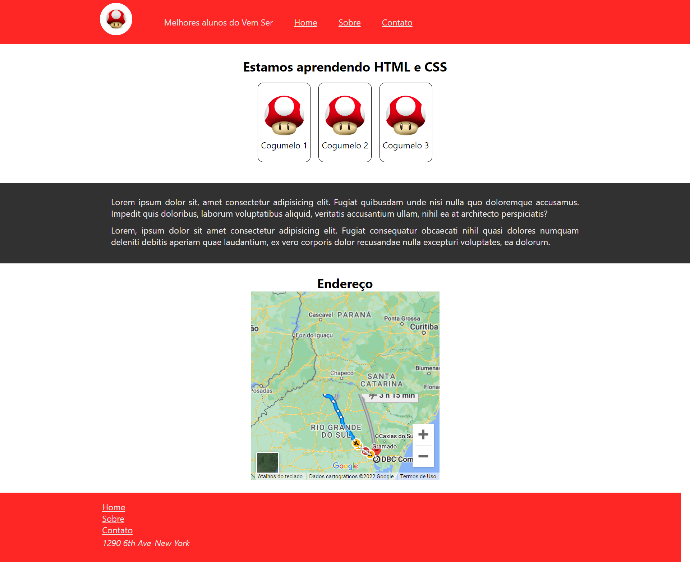

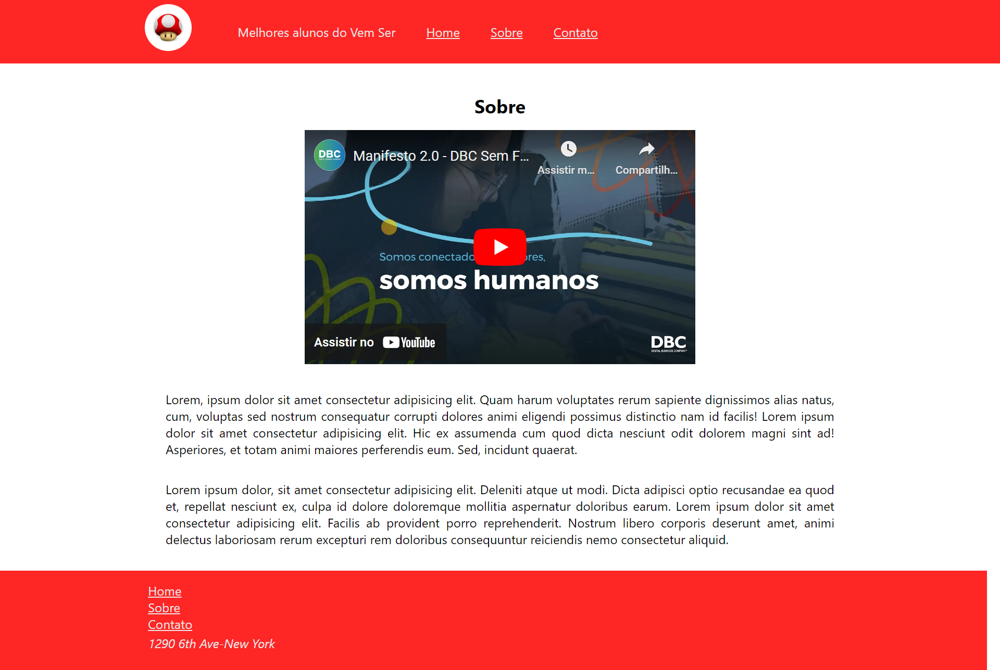

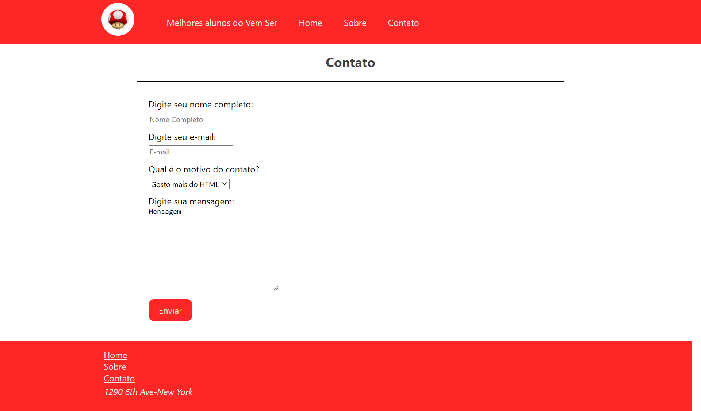

📌 #exercicio3
-Praticando flexbox.

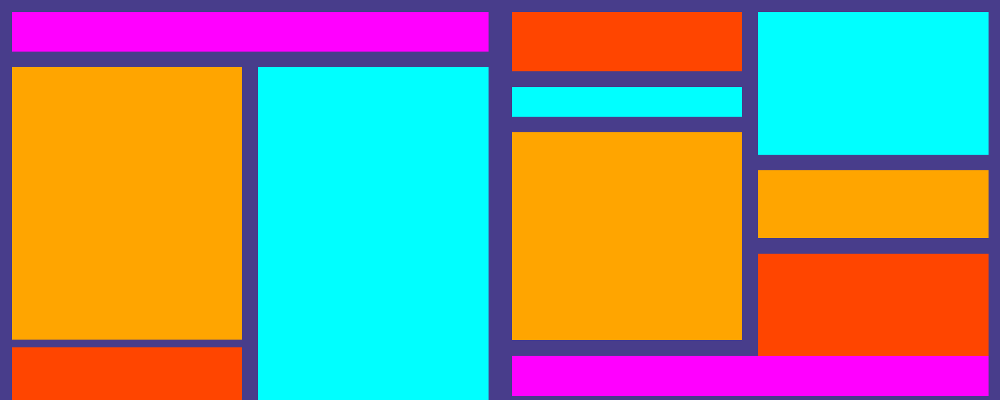

📌 #homework3
-Construcao de um site com flexbox a partir de um modelo do Figma.

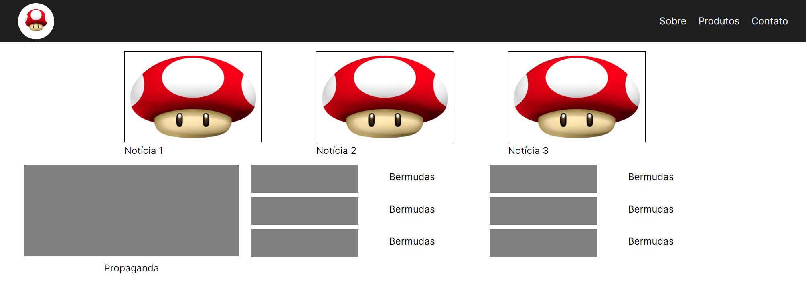

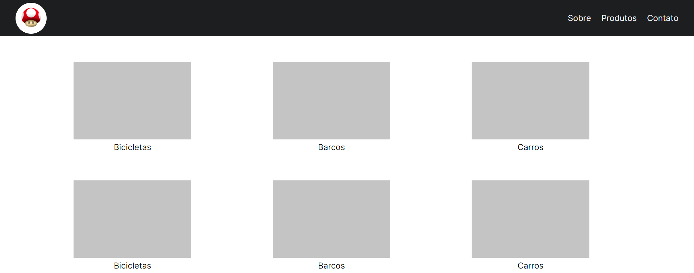

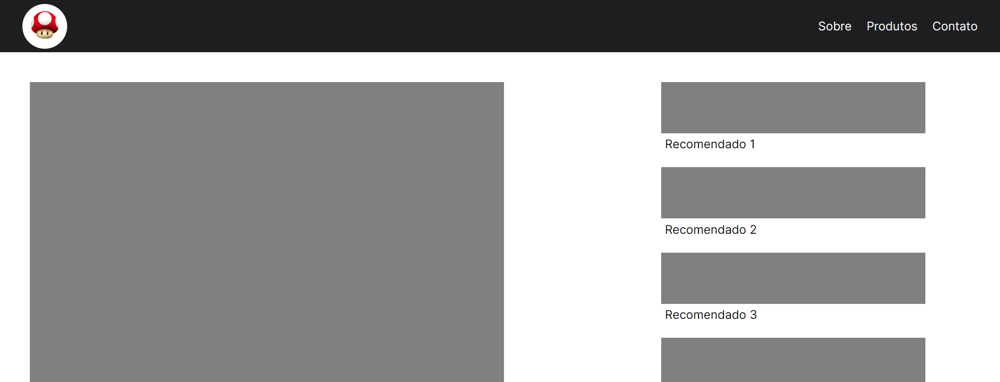

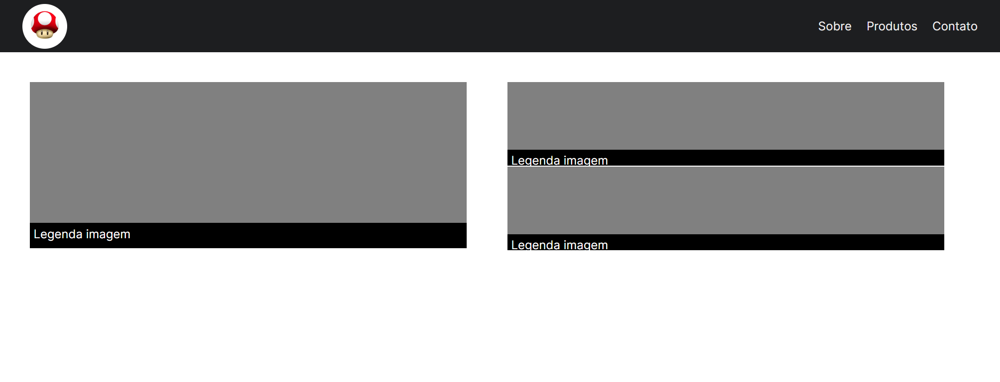

📌 #exercicio4
-Praticando grid

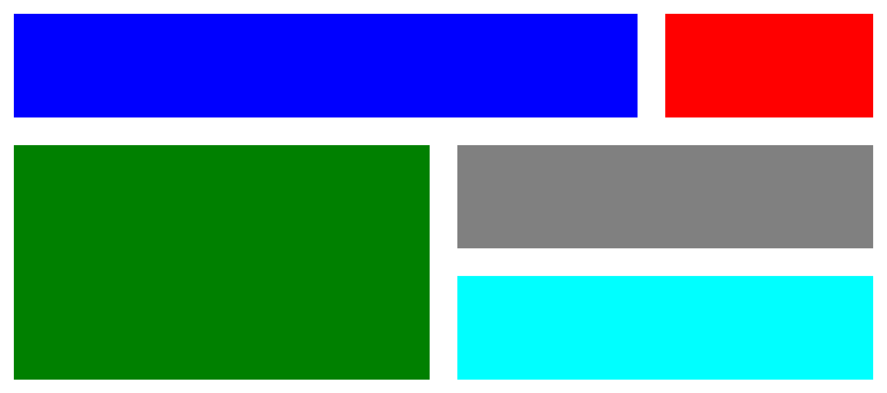

📌 #homework4
-Construcao de um site com grid a partir de um modelo do Figma.

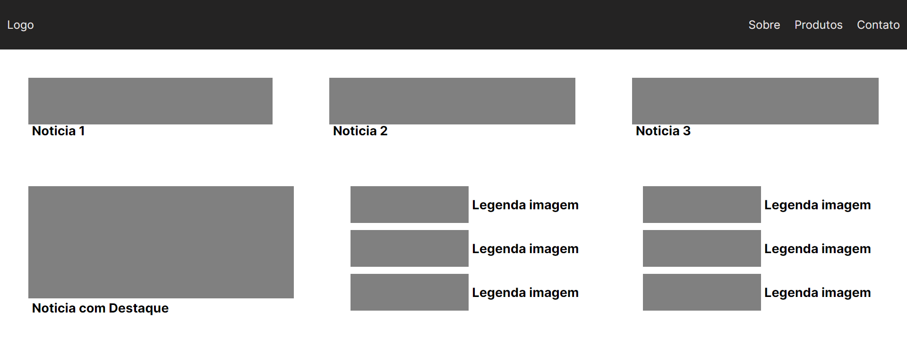

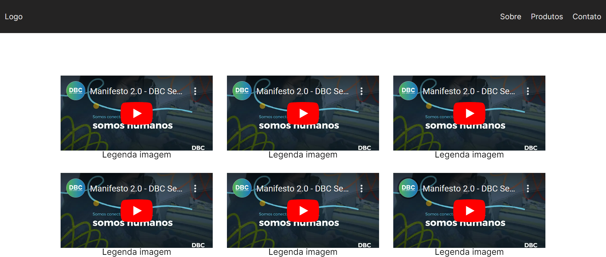

📌 #exercicio5
-Bootstrap

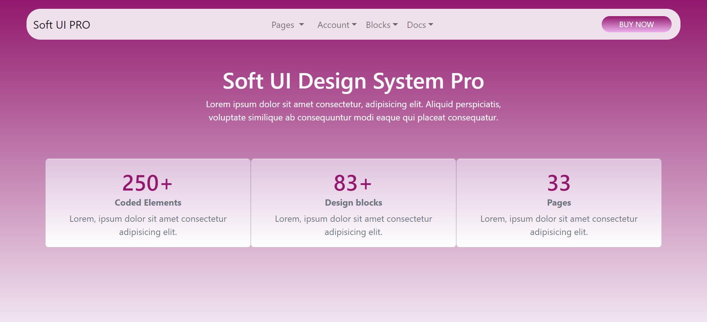

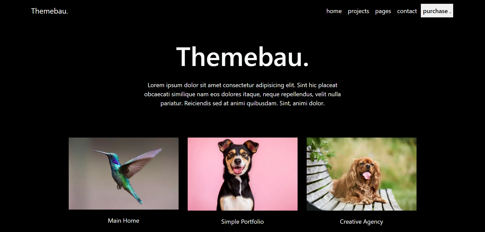

📌 #exercicio6
- Responsividade.

📌 #homework6
- Mobile first.

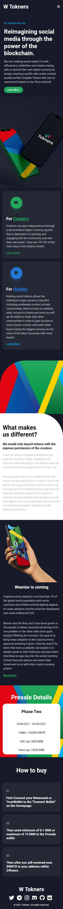

📌 #homework8

-Design System, reproducao do site do Trello

