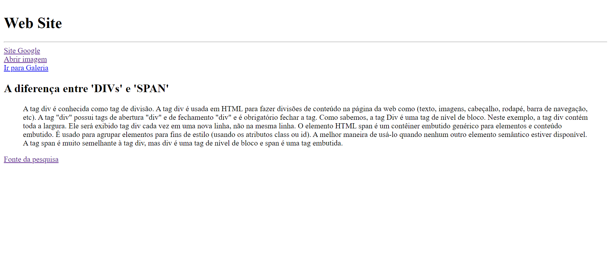
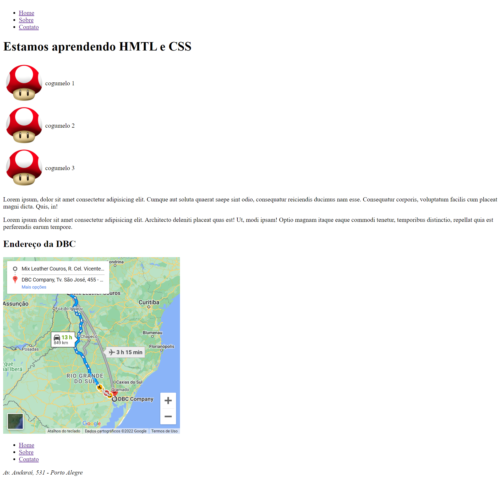
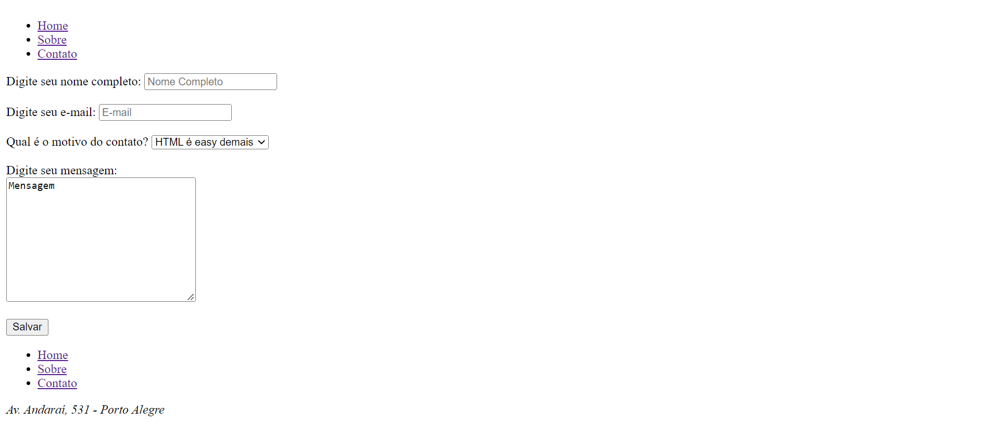
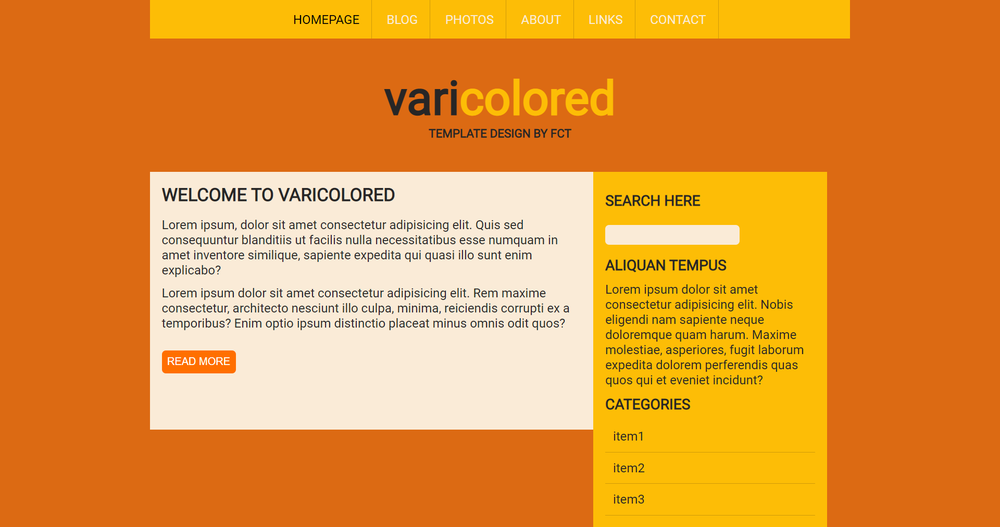
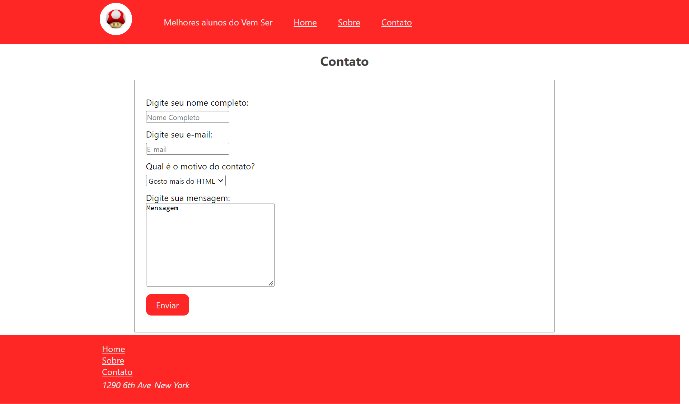
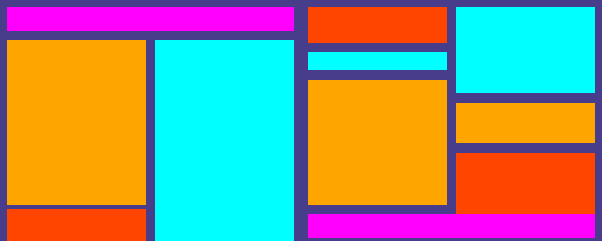
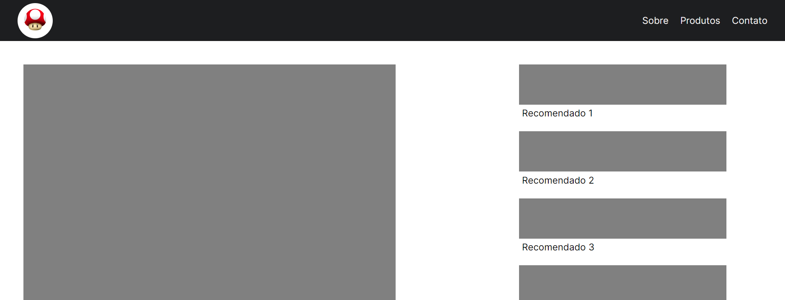
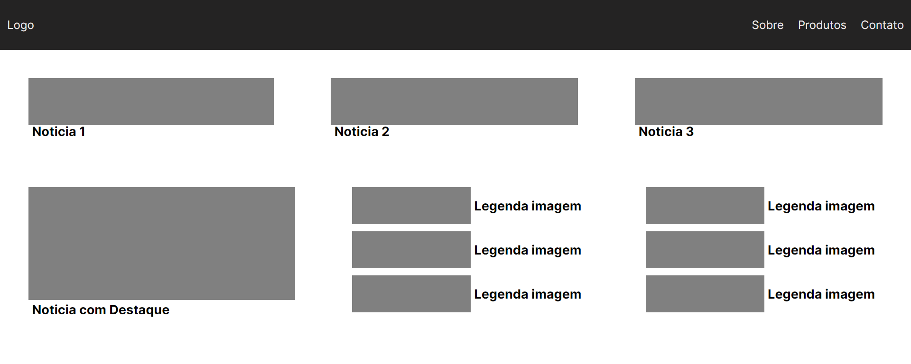
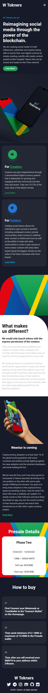

#VemSerDBC10
#HTML/CSS
Neste repositorio estao as atividades e homeworks desenvolvidos no modulo de HTML/CSS.

#exercicio1
1. Criacao de uma pasta;
2. Criar um arquivo index.html e galeria.html nesta pasta;
3. Declarar o codigo fonte base do HTML e:
- Inserir um Titulo na Guia do Navegador com nome de Exercicio 1
- Inserir um titulo no documento --> Web Site
- Inserir uma linha horizontal
- Inserir tres links (um para um site, outro para uma imagem e outro para o arquivo galeria.html);
- Inserir 4 imagens pequenas no arquivo galeria.html dentro de uma tabela ---> e nao esquecer de configurar o Titulo do navegador para Galeria;
- Inseri um link para voltar para a o index no arquivo galeria.html

#homework1
- Atividade desenvolvida em HTML

#exercicio2
- Construcao de uma pagina com html e csss usando tags semanticas.

#homework2
- Construcao de um site com HTML utilizando tags semanticas e CSS a partir de um modelo do Figma. 

#exercicio3
-Praticando flexbox.

#homework3
-Construcao de um site com flexbox a partir de um modelo do Figma.

#exercicio4
-Praticando grid

#homework4
-Construcao de um site com grid a partir de um modelo do Figma.

#exercicio5
-Bootstrap

#exercicio6
- Responsividade.

#homework6
- Mobile first.

